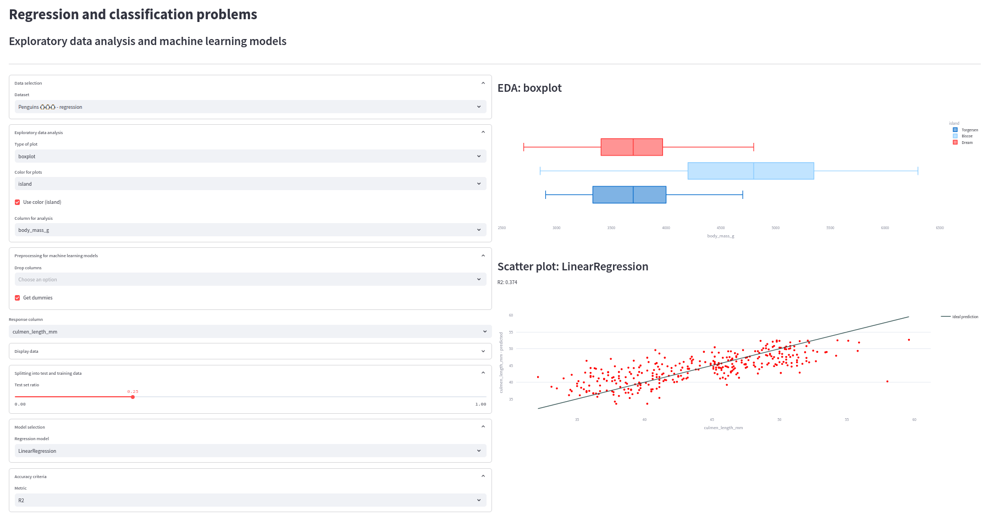

# Regression and classification problems

Interactive dashboard created during PyData course by PyLadies in fall 2024. Visualizes data from several datasets (fish, penguins, iris) using exploratory data analysis and machine learning models.



Created with the following libraries:
- pandas==2.2.3
- plotly==5.24.1
- scikit-learn==1.5.2
- streamlit==1.40.2
- matplotlib==3.9.3
- altair==5.5.0
- pyarrow==18.1.0

To run in a terminal, use:
```
streamlit run fishboard.py
```

To run on Streamlit Cloud, use:
```
https://pydata-regression-classification.streamlit.app/
```
